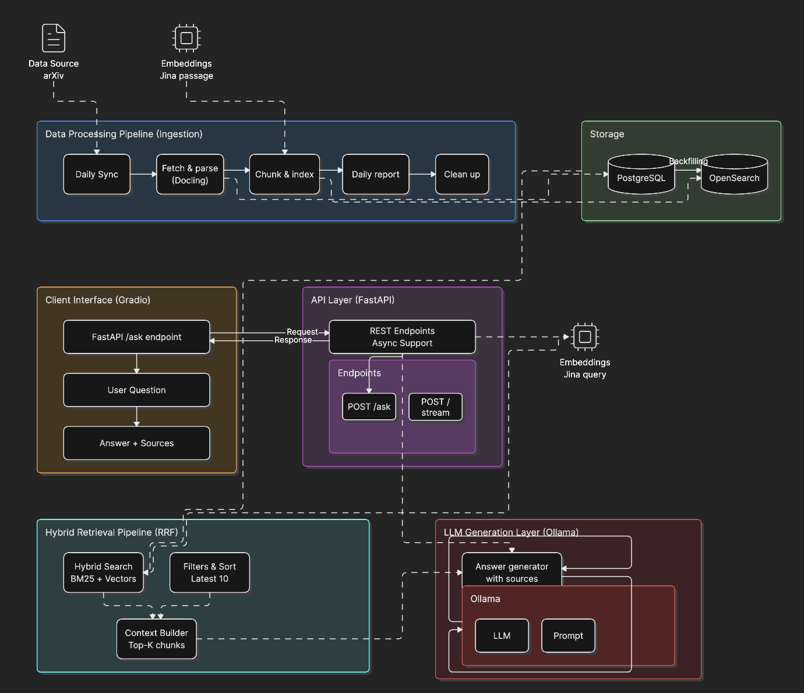

# arXiv AI Paper Curator

> A production-grade RAG (Retrieval-Augmented Generation) system that automatically ingests daily arXiv CS.AI papers, indexes them with hybrid BM25 + semantic search, and answers research questions via a streaming LLM API — all running locally on your machine.



---

## What It Does

Ask a natural language question like _"What are the latest approaches to graph neural networks for molecules?"_ and get a cited, context-grounded answer sourced directly from arXiv papers ingested that morning — with full observability, sub-second cached responses, and a streamed Gradio UI.

The system runs end-to-end without any cloud LLM dependencies: PDFs are parsed locally with Docling, embeddings come from Jina AI, and generation is handled by Ollama (Llama 3.2, Qwen 2.5, etc.).

---

## Architecture

```
arXiv API ──► Airflow DAG ──► PDF Parser (Docling) ──► PostgreSQL
                                                           │
                                                    Section-aware
                                                      Chunker
                                                           │
                                              Jina Embeddings v3 (1024-dim)
                                                           │
                                                    OpenSearch 2.19
                                                  (BM25 + kNN + RRF)
                                                           │
FastAPI (/ask, /stream) ◄──── Ollama (local LLM) ◄────────┘
    │                                                    
    ├── Redis Cache (6h TTL, exact-match)
    ├── Langfuse Tracer (every RAG span)
    └── Gradio UI (SSE streaming)
```

**Weekly build log:** [`notebooks/`](notebooks/) documents the system being built from scratch across 6 weeks — from raw API calls to a fully observed, cached RAG pipeline.

---

## Key Features

- **Automated daily ingestion** — Airflow DAG runs Mon–Fri at 6 AM UTC, fetches up to 15 new `cs.AI` papers, downloads PDFs concurrently (rate-limited), parses them with OCR/table support, and stores structured content in PostgreSQL.
- **Hybrid retrieval** — OpenSearch hybrid index combines BM25 keyword scoring with 1024-dim Jina vector search, fused via Reciprocal Rank Fusion (RRF). Degrades gracefully to BM25 if embeddings are unavailable.
- **Section-aware chunking** — Papers are split into 600-word overlapping chunks that respect document section boundaries, preserving context for retrieval.
- **Streaming RAG API** — `/ask` returns a complete JSON response; `/stream` pushes Server-Sent Events for token-by-token UI streaming. Both check Redis for exact-match cache hits first.
- **Full observability** — Every RAG request is traced in Langfuse: embedding latency, search hits, prompt construction, generation time, and token counts — all in a self-hosted dashboard.
- **One-command stack** — `make start` boots the entire system (API, PostgreSQL, OpenSearch, Redis, Airflow, Ollama, Langfuse) via Docker Compose.

---

## Tech Stack

| Layer | Technology |
|---|---|
| **API** | FastAPI 0.115, Python 3.12, `uv` package manager |
| **LLM** | Ollama (Llama 3.2 1B/3B, Llama 3.1 8B, Qwen 2.5 7B) |
| **Embeddings** | Jina Embeddings v3 — 1024-dim, task-aware (query vs passage) |
| **Vector + Keyword Search** | OpenSearch 2.19 — hybrid BM25/kNN index with RRF pipeline |
| **PDF Parsing** | Docling + Tesseract OCR + Poppler (table extraction) |
| **Data Pipeline** | Apache Airflow 2.10 — PythonOperator DAG, retry logic, concurrency control |
| **Database** | PostgreSQL 16 — paper metadata, full text, chunk storage via SQLAlchemy |
| **Cache** | Redis 7 — SHA-256 keyed exact-match cache, 6h TTL, LRU eviction |
| **Observability** | Langfuse v2 (self-hosted) + ClickHouse for analytics |
| **UI** | Gradio 4 — real-time streaming chat with source links |
| **Infra** | Docker Compose, Makefile, pre-commit hooks, Ruff, mypy |

---

## Project Structure

```
arxiv-ai/
├── src/
│   ├── main.py                    # FastAPI app with lifespan service wiring
│   ├── config.py                  # Pydantic Settings — all config via env vars
│   ├── routers/
│   │   ├── ask.py                 # /ask (JSON) and /stream (SSE) RAG endpoints
│   │   ├── hybrid_search.py       # /hybrid-search — paginated BM25/vector search
│   │   └── ping.py                # /health — checks all downstream services
│   ├── services/
│   │   ├── arxiv/                 # arXiv Atom API client
│   │   ├── pdf_parser/            # Docling PDF → structured sections
│   │   ├── embeddings/            # Jina async embeddings client
│   │   ├── indexing/              # HybridIndexingService + TextChunker
│   │   ├── opensearch/            # OpenSearch client, query builder, index config
│   │   ├── ollama/                # Ollama client + RAG prompt builder
│   │   ├── cache/                 # Redis exact-match cache client
│   │   └── langfuse/              # RAGTracer — wraps every pipeline span
│   ├── models/                    # SQLAlchemy ORM models
│   ├── schemas/                   # Pydantic request/response schemas
│   └── gradio_app.py              # Gradio UI component (streaming consumer)
├── airflow/
│   ├── dags/
│   │   ├── arxiv_paper_ingestion.py   # Main DAG: setup→fetch→index→report→cleanup
│   │   └── arxiv_ingestion/           # Modular task functions
│   │       ├── setup.py               # Service health checks
│   │       ├── fetching.py            # arXiv API fetch + PDF download
│   │       ├── indexing.py            # Chunking + embedding + OpenSearch bulk index
│   │       └── reporting.py           # Daily run statistics
│   └── Dockerfile                 # Custom Airflow image with project deps
├── notebooks/                     # Week-by-week experiment notebooks (weeks 1–6)
├── tests/                         # Pytest suites: unit, API, integration
├── compose.yml                    # Full Docker Compose stack (10 services)
├── gradio_launcher.py             # Standalone Gradio launcher
├── Makefile                       # Dev workflow shortcuts
└── pyproject.toml                 # uv/ruff/mypy/pytest config
```

---

## Getting Started

### Prerequisites

- Docker + Docker Compose
- GNU Make
- Jina AI API key — [free tier available](https://jina.ai/embeddings) (required for hybrid search; BM25-only works without it)
- Python 3.12 + [uv](https://github.com/astral-sh/uv) for local dev outside Docker

### 1. Configure environment

```bash
cp .env.example .env
# Set JINA_API_KEY and optionally LANGFUSE keys
```

### 2. Start the full stack

```bash
make start        # builds API image, starts all 10 services
make status       # verify containers are healthy
make logs         # follow aggregated logs
```

Services come up at:

| Service | URL |
|---|---|
| FastAPI docs | http://localhost:8000/docs |
| Gradio UI | `python gradio_launcher.py` → http://localhost:7861 |
| Airflow | http://localhost:8080 |
| Langfuse | http://localhost:3000 |
| OpenSearch Dashboards | http://localhost:5601 |

### 3. Ask a question

```bash
# BM25 search
curl -X POST http://localhost:8000/api/v1/ask \
  -H "Content-Type: application/json" \
  -d '{"query": "transformers for time series forecasting", "top_k": 5}'

# Hybrid search (requires JINA_API_KEY)
curl -X POST http://localhost:8000/api/v1/hybrid-search \
  -H "Content-Type: application/json" \
  -d '{"query": "diffusion models for protein folding", "use_hybrid": true, "size": 5}'
```

### 4. Local development (without Docker for the API)

```bash
uv sync
docker compose up postgres redis opensearch ollama -d
uv run uvicorn src.main:app --reload --port 8000
```

---

## API Reference

| Endpoint | Method | Description |
|---|---|---|
| `/api/v1/health` | GET | Health check — pings PostgreSQL, OpenSearch, and Ollama |
| `/api/v1/hybrid-search` | POST | Paginated search with BM25 or hybrid retrieval, with highlights |
| `/api/v1/ask` | POST | RAG Q&A — retrieves chunks, builds prompt, calls Ollama, caches result |
| `/api/v1/stream` | POST | Same as `/ask` but streams tokens via Server-Sent Events |

**`/ask` request body:**

```json
{
  "query": "What is chain-of-thought prompting?",
  "top_k": 5,
  "use_hybrid": true,
  "model": "llama3.2:1b",
  "categories": ["cs.AI"]
}
```

**Response includes:** `answer`, `sources` (arXiv PDF URLs), `chunks_used`, `search_mode`.

---

## Data Pipeline (Airflow DAG)

The `arxiv_paper_ingestion` DAG runs Monday–Friday and orchestrates:

```
setup_environment
    └── fetch_daily_papers          # arXiv API → download PDFs (concurrent, rate-limited)
            └── index_papers_hybrid # Docling parse → section chunker → Jina embed → OpenSearch bulk
                    └── generate_daily_report
                            └── cleanup_temp_files
```

- Fetches up to 15 `cs.AI` papers from the previous day
- Retries failed downloads up to 3× with exponential backoff
- Chunking: 600 words, 100-word overlap, section-boundary aware
- Bulk-indexes chunks with embeddings into OpenSearch

---

## Observability

Every `/ask` and `/stream` request generates a Langfuse trace with nested spans:

1. `embedding` — Jina query embedding latency
2. `search` — OpenSearch hit count and scores
3. `prompt_construction` — chunk selection and prompt size
4. `generation` — Ollama model, token count, latency

Redis cache key is a SHA-256 hash of `(query, model, top_k, use_hybrid, categories)`. Cache hits skip steps 1–4 entirely and return in < 5ms.

---

## Testing

```bash
uv run pytest                    # all tests
uv run pytest --cov=src          # with HTML coverage report
uv run pytest tests/unit/        # unit tests only
uv run pytest tests/integration/ # integration (requires running services)
```

Linting and type checks:

```bash
uv run ruff check --fix && uv run ruff format
uv run mypy src/
```

---

## Development Journey

This project was built incrementally across 6 weeks, documented in [`notebooks/`](notebooks/):

| Week | Focus |
|---|---|
| Week 1 | Infrastructure setup — Docker, PostgreSQL, FastAPI skeleton |
| Week 2 | arXiv data ingestion — API client, PDF downloads, Airflow DAG |
| Week 3 | OpenSearch integration — BM25 indexing, query builder |
| Week 4 | Hybrid search — Jina embeddings, kNN index, RRF fusion |
| Week 5 | Complete RAG — Ollama integration, `/ask` endpoint, Gradio UI |
| Week 6 | Observability — Langfuse tracing, Redis caching, monitoring |
